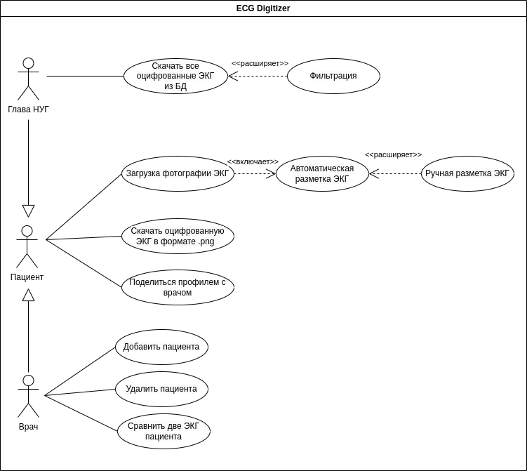

# Лабораторная работа №1

**Тема:** Формулирование требований к программной системе

**Цель работы:** Научиться анализировать поставленную задачу, формулировать функциональные и нефункциональные требования к проектируемой системе.

## Перечень заинтересованных лиц (стейкхолдеров) с краткими описаниями (2 балла)
- Глава научно-исследовательской группы - заинтересован в получении работающей системы для накопления данных.
- Надзорные органы РФ - заинтересованы в ненарушении законов КоАП РФ в части защиты персональных данных.
- Пациенты и врачи - заинтересованы в защите персональной информации.

## Перечень функциональных требований (2 балла)
- Должна быть реализован личный кабинет.
- Система должна автоматически разметить ЭКГ, то есть указать, на какой части изображения находится каждое отведение.
- Пользователь может поправить автоматическую разметку.
- Система сохраняет полученные данные в БД.
- Оцифрованные пользователем ЭКГ остаются в его личном кабинете.
- Из оцифрованных ЭКГ пользователь может сгенерировать картинку ЭКГ.
- Пациент может предоставить доступ к своим ЭКГ врачу.
- Врач может добавлять и удалять пациентов.
- Врач может просматривать и сравнивать ЭКГ пациента.
- Глава научно-учебной группы может выгружать все оцифрованные ЭКГ, предварительно их отфильтровав.
- Кроссплатформенность: система доступна на любых популярных ОС (Linux, macOS, Windows, Android, iOS).

## Диаграмма вариантов использования для функциональных требований (2 балла)
ECG Digitizer - рабочее название системы

## Перечень сделанных предположений (всё, что не оговорено в постановке явно можно “додумать” самостоятельно) (2 балла)
- Необходимо реализовать алгоритм оцифровки ЭКГ.
- Пользователь может выгрузить несколько ЭКГ.
- И Врач, и Глава НУГ могут выступать в роли Пациента.

## Перечень нефункциональных требований (2 балла)
- Алгоритм автоматической разметки должен выдавать результат в течение 30 секунд.
- Предусмотреть защиту персональных данных (пользователь согласен на обработку и хранение данных).
- Выбранное ПО будет доступно на протяжении срока реализации проекта.
