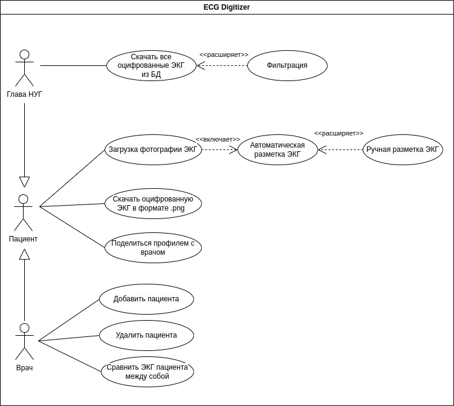

# Лабораторная работа №1

**Тема:** Формулирование требований к программной системе

**Цель работы:** Научиться анализировать поставленную задачу, формулировать функциональные и нефункциональные требования к проектируемой системе.

## Перечень заинтересованных лиц (стейкхолдеров) с краткими описаниями (2 балла)

- Научный руководитель - заинтересован в сдаче ВКР
- Глава научно-исследовательской группы - заинтересован в получении работающей системе для накопления данных
- Надзорные органы РФ - заинтересованы в ненарушении законов КоАП РФ в части защиты персональных данных
- Пациенты - заинтересованы в защите персональной информации

## Перечень функциональных требований (2 балла)

- Пользователь загружает фотографию ЭКГ или её скан
- Пользователь может разметить поступившее изображение
- Полученная информация с оцифрованных изображений заносится в базу данных
- Пользователь может выгрузить результаты оцифровки только тех ЭКГ, которые он загрузил
- Руководитель научно-учебной группы может выгрузить результаты оцифровки всех ЭКГ 

## Диаграмма вариантов использования для функциональных требований (2 балла)

## Перечень сделанных предположений (всё, что не оговорено в постановке явно можно “додумать” самостоятельно) (2 балла)
- Собирать нужно не только ЭКГ, но и дополнительную информацию о состоянии здоровья пациента.
- Необходимо реализовать алгоритм оцифровки ЭКГ.
- Необходимо уточнить формат, в котором хранится оцифрованные 

## Перечень нефункциональных требований (2 балла)
- Разработка должна вестись с использованием свободного программного обеспечения
- Выбранное ПО будет доступно на протяжении срока реализации проекта
